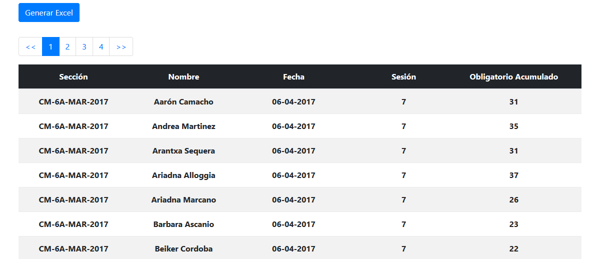
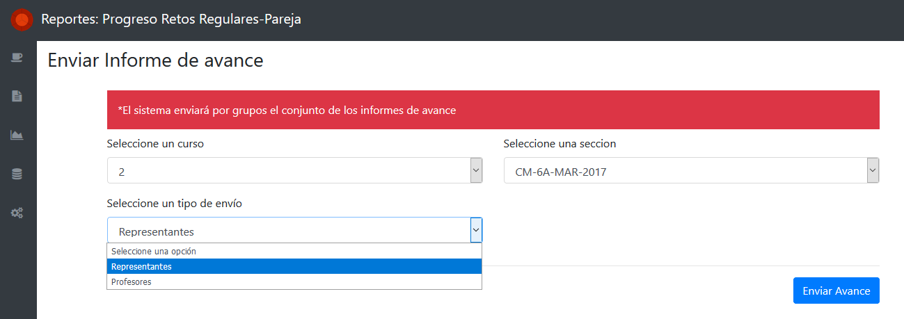
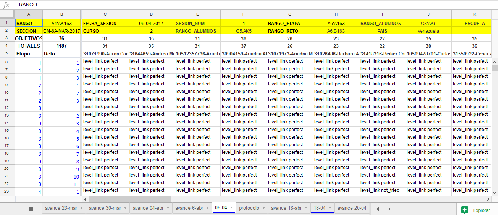
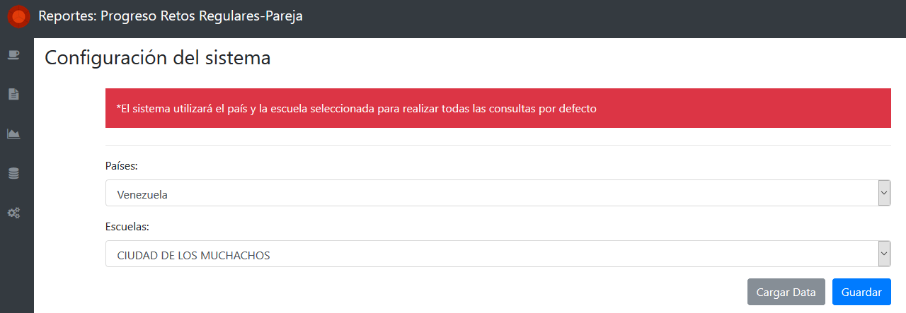
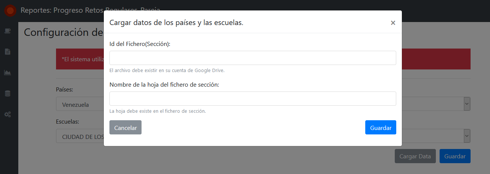

# Manual de usuario

## Modulos del software

1. Reportes de Tableau.
2. Informe de Avances.
3. Carga de datos avance.
4. Configuración del sistema.

### 1.Reportes de Tableau

Esta seccion se compone de tres campos:

* Code.
* Edpuzzle videos.
* Edpuzzle preguntas.

Para todos estos casos lo primero que se debe hacer es seleccionar los cursos vinculados al país y a la escuela seleccionada, luego la sección y por último la sesión, al hacer esto se generará una tabla con los datos de los estudiantes mostrándolos en orden **alfabético**.

  

También se habilitara un botón que lleva como texto *Generar Excel*, con el cual al hacer click sobre él se generará un fichero con formato excel, el mismo puede ser utilizado junto la herramienta Tableau para observar la información generada. 

  

### 2.Informe de Avances

Esta sección se compone de dos(2) campos

* Informe de avance.
* Enviar avance.

#### Informe de avance:  
  
Igual que lo explicado en la sección de *Reportes de Tableau* se debe ingresar el curso, la sección y luego se seleccionará un alumno vinculado a la sección escogida, al hacer esto aparecerá un botón con el texto *Ver Avance*

Al hacer click sobre el botón el sistema procederá a abrir una nueva pestaña en la cual contendra el informe de avance del alumno anteriormente seleccionado.

#### Informe de avance:  

Al hacer click, el sistema le pedirá que ingrese los datos del curso y la sección, luego se le presentará un campo donde tendrá que seleccionar el tipo de envío que desea realizar, *representates* y *profesores*, el primero se utiliza para enviar a cada representate el respectivo informe de avance de su representado, el segundo se utiliza para enviar por lotes el informe de avance de los alumnos a los profesores de la sección escogida, estos profesores y representantes se encuentran almacenados en sus respectivos archivos con fines relacional. 

### 3.Carga de datos avance

Igual que en la sección **Reportes de Tableau** esta sección posee tres(3) campos:

* Code.
* Edpuzzle videos.
* Edpuzzle preguntas.

En esta seccion se debe llenar los compos con la información del fichero relacionado, dentro del campo **Id del Fichero(Sección)** hay que colocar el *id* del fichero al cual hace referencia.

El id es el numero de identificacion que Google le da a todos los ficheros dentro del ambiente de Google Sheet. dada la siguiente URL de un archivo

> https://docs.google.com/spreadsheets/d/1LQLXnl3gvDsZYKabt1oo1-3KKdvS4gduBeFN9Ateqek/edit#gid=556121044

el número de identificación es aquel que se encuentra seguido del los léxemas */d/* y */*, es decir, para este ejemplo el **id** del fichero sería el siguiente, **1LQLXnl3gvDsZYKabt1oo1-3KKdvS4gduBeFN9Ateqek**, el campo **Nombre de la hoja del fichero de sección**, recibe como entrada el nombre de la hoja donde se encuentra la tabla con los datos que se desea, ese nombre debe ser único por fichero, ya que en caso contrario el sistema podría fallar.

### 4.Configuración del sistema

En la configuración del sistema se establece los datos iniciales para la realización de las diferentes consultas que son ejecutadas por el servidor, aquí se cargan y se seleccionan los campos de *país* y *escuela*.  
  
  

Al cargar los datos del fichero se debe especificar el **id** del fichero donde se encuentra almacenada la data que va ser utilizada junto con el nombre de la hoja contenedora, la cual debe ser única por pestaña. 

